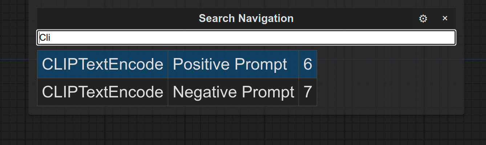

# Usage

1. Open/Close with `Shift + F`
2. Search for nodes by title or name (set titles manually if there's a lot of duplicate nodes)
3. `Enter` to center view on selected node
4. `Shift + Left/Right` to cycle through navigation history
5. `?` to re-focus search bar after doing other things
6. Open settings ⚙ to change hotkeys and other settings

# Installation

1. `cd` to `ComfyUI/custom_nodes`
2. `git clone` this repository

